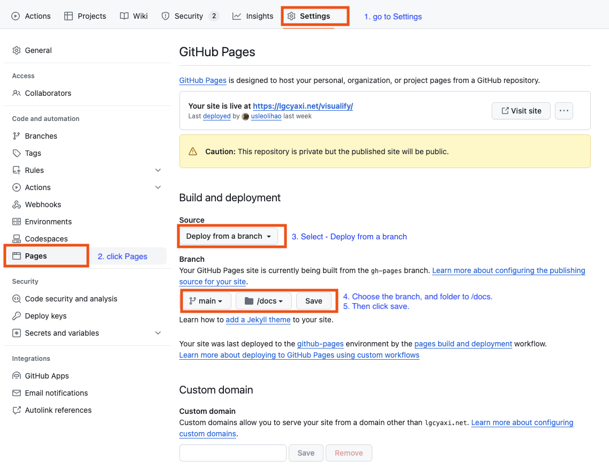

# Deploy

## On Your Local Machine

## GitHub Pages

There are three places to populate your docs for your GitHub repository:

-   `docs/` folder
-   main branch
-   gh-pages branch

It is recommended that you save your files to the `./docs` subfolder of the
`main` branch of your repository. Then select `main branch /docs folder` as your
GitHub Pages source in your repository's settings page.

!> You can also save files in the root directory and select `main branch`.
You'll need to place a `.nojekyll` file in the deploy location (such as `/docs`
or the gh-pages branch)
